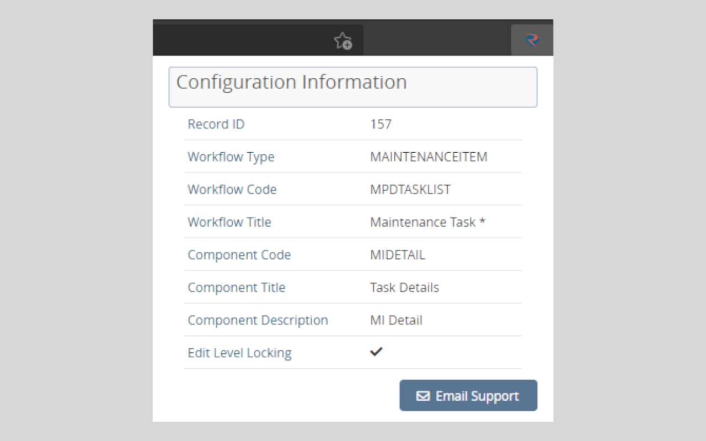

# Envision Helper

## About

This extension will give you access to the configuration information you would normally need to run some Javascript commands for. Instead, you are able to click the extension icon in your browser to display information which you can use to configure your menu and permissions more easily.

The extension also allows you to email Rusada support with some very useful information pre-populated in the body of your email. This should help support to understand your problem much quicker. Please make sure you click the "Email Support" button from the screen you are having problems with - the extension only includes information from the current screen.

## Change Log

* Version 1.3
  * Added Component Description to configuration information.
  * Updated UI to closely match Envision
* Version 1.2
  * Moved functionality from a charm within Envision to the extension itself. Now you just need to click the Rusada logo in your browser to view the same configuration information.
  * Removed the scary "this extension wants access to all of your prized posessions" permission. Nothing has changed in the way the extension works, I just learned the proper way of checking the URL you are currently viewing. This is all the permission was used for before. The extension only needs this to check you are on an Envision page.
  * Added new "Email Support" button. This will take the displayed information (and some extra information that is useful to support) and paste it into an email to support for you. Just add a subject and a description of the issue you are having and click send.
* Version 1.1
  * Styling changes to the side menu which is displayed in the system. Nothing special to explain here.
  * Fixed a bug where an error was thrown in specific scenarios when the charm was clicked on the User Dashboard page.
* Version 1
  * Initial release.
