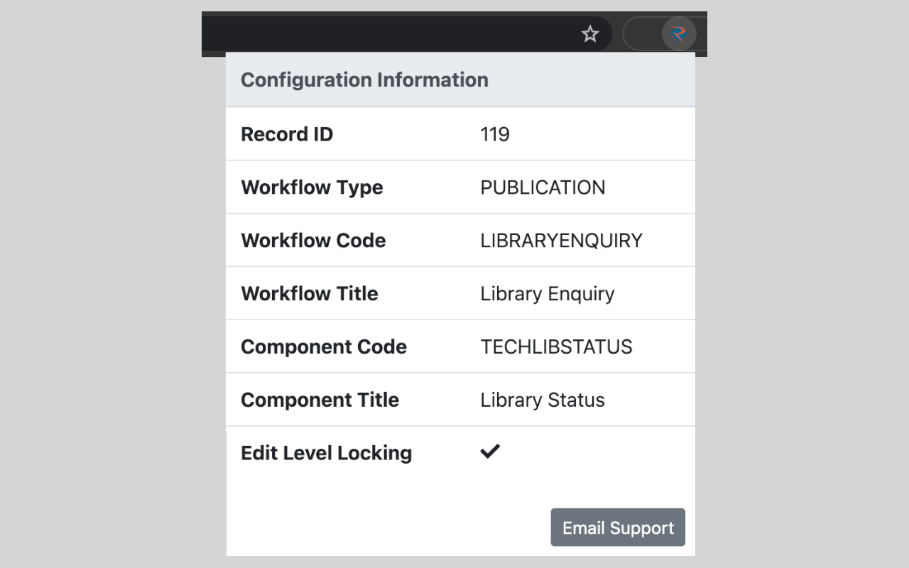

# Envision Helper

This extension will give you access to the configuration information you would normally need to run some Javascript commands for. Instead, you are able to click the extension icon in your browser to display information which you can use to configure your menu and permissions more easily.

The extension also allows you to email Rusada support with some very useful information pre-populated in the body of your email. This should help support to understand your problem much quicker. Please make sure you click the "Email Support" button from the screen you are having problems with - the extension only includes information from the current screen.

